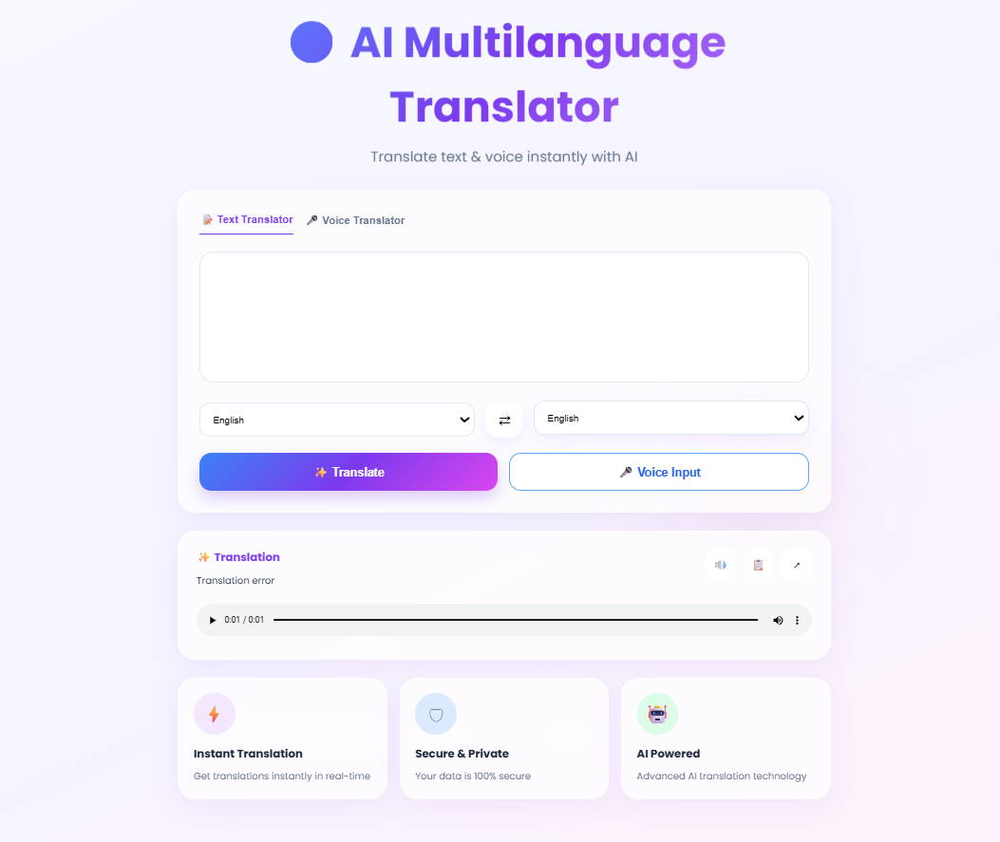

# 🌍 AI Powered Multi Language Translator

A modern AI-powered multilingual translator web application that converts speech to text, 
translates content into multiple languages, and generates translated voice output with a clean responsive UI.


## 🚀 Features

- 🎤 Voice Input Support
- 🌐 Multi Language Translation
- 🔊 Audio Output for Translated Text
- 🌙 Dark / Light Mode UI
- 📱 Responsive Modern Interface
- ⚡ Real-Time Translation
- 🤖 AI Powered Translation System

## 🛠 Technologies Used

### Frontend
- HTML5
- CSS3
- JavaScript

### Backend
- Python
- Flask

### APIs & Libraries
- SpeechRecognition
- Google Translate API
- gTTS


## 📂 Project Structure

```bash
AI-Multi-Language-Translator/
│
├── static/
│   ├── style.css
│   └── output.mp3
│
├── templates/
│   └── index.html
│
├── app.py
├── image.png
└── README.md
```


## ⚙️ Installation & Setup

### 1️⃣ Clone Repository

```bash
git clone https://github.com/amanshukla246/AI-Multi-Language-Translator.git
```


### 2️⃣ Install Dependencies

```bash
pip install flask googletrans==4.0.0-rc1 SpeechRecognition gTTS
```


### 3️⃣ Run Application

```bash
python app.py
```

---

### 4️⃣ Open In Browser

```bash
http://127.0.0.1:5000
```

---

## 🖥 Project Interface



---

## 📌 Future Enhancements

- AI Chat Translation
- Live Voice Translation
- Language Detection
- Translation History
- User Authentication
- React Frontend Upgrade

---

## 👨‍💻 Developer

Aman Shukla

---

## ⭐ GitHub Repository

https://github.com/amanshukla246/AI-Multi-Language-Translator

